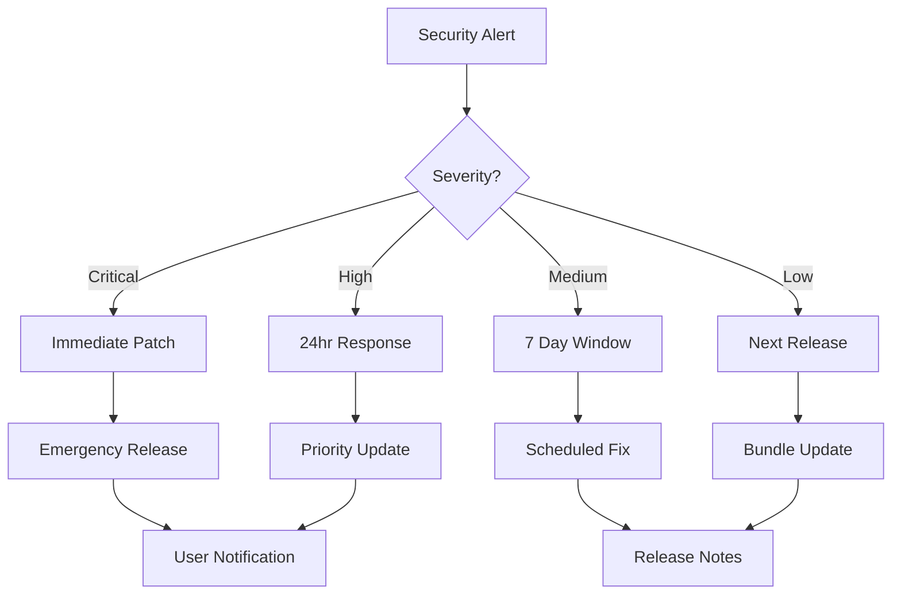

# Dependency Update Strategy
## node-red-contrib-wger

**Version**: 1.0  
**Last Updated**: 2025-09-04  
**Review Cycle**: Quarterly  

---

## 1. Core Principles

### 1.1 Stability First
- Production stability takes precedence over latest features
- Never update dependencies without thorough testing
- Maintain backward compatibility within major versions

### 1.2 Security Always
- Security updates have highest priority
- Apply security patches within 7 days of disclosure
- Run weekly automated security audits

### 1.3 Progressive Enhancement
- Adopt new features gradually
- Test in development before staging
- Monitor community feedback before major updates

---

## 2. Dependency Categories

### Critical Dependencies (Core Functionality)
**Update Frequency**: Conservative  
**Risk Tolerance**: Very Low  

| Package | Role | Update Policy |
|---------|------|---------------|
| axios | HTTP client | Patch: immediate, Minor: 30 days, Major: planned |
| validator | Input validation | Patch: immediate, Minor: 14 days, Major: planned |
| xss | Security sanitization | Security only until replacement planned |

### Development Dependencies (Build & Test)
**Update Frequency**: Moderate  
**Risk Tolerance**: Medium  

| Package | Role | Update Policy |
|---------|------|---------------|
| mocha | Test runner | Patch: weekly, Minor: monthly, Major: quarterly |
| sinon | Test mocking | Patch: weekly, Minor: quarterly, Major: yearly |
| node-red | Development environment | Match target deployment version |

### Node-RED Specific
**Update Frequency**: Synchronized  
**Risk Tolerance**: Low  

- Follow Node-RED release cycle
- Test against multiple Node-RED versions
- Maintain compatibility matrix

---

## 3. Update Process

### 3.1 Automated Monitoring

#### Weekly Automated Checks
```yaml
# .github/workflows/dependency-check.yml
name: Dependency Audit
on:
  schedule:
    - cron: '0 9 * * 1'  # Mondays at 9 AM
  workflow_dispatch:

jobs:
  audit:
    runs-on: ubuntu-latest
    steps:
      - uses: actions/checkout@v4
      - uses: actions/setup-node@v4
        with:
          node-version: '20'
      - run: npm ci
      - run: npm audit --json > audit-report.json
      - run: npm outdated --json > outdated-report.json
      - name: Process Reports
        run: |
          if [ $(npm audit --audit-level=moderate) ]; then
            echo "Security vulnerabilities found!"
            exit 1
          fi
```

#### Dependabot Configuration
```yaml
# .github/dependabot.yml
version: 2
updates:
  - package-ecosystem: "npm"
    directory: "/"
    schedule:
      interval: "weekly"
      day: "monday"
      time: "09:00"
    open-pull-requests-limit: 5
    groups:
      development-dependencies:
        patterns:
          - "mocha"
          - "sinon"
          - "should"
        update-types:
          - "minor"
          - "patch"
    labels:
      - "dependencies"
      - "automated"
    reviewers:
      - "democratize-technology/maintainers"
```

### 3.2 Manual Review Process

#### Patch Updates (x.x.N)
1. Review changelog for fixes
2. Check for regression reports
3. Run automated test suite
4. Deploy to development environment
5. Merge if tests pass

#### Minor Updates (x.N.x)
1. Review new features and deprecations
2. Check compatibility with Node-RED
3. Update relevant documentation
4. Full regression testing
5. Staging deployment (1 week minimum)
6. Production deployment with monitoring

#### Major Updates (N.x.x)
1. Create dedicated update branch
2. Review migration guide
3. Assess breaking changes impact
4. Update code for compatibility
5. Comprehensive testing plan
6. Staging deployment (2 weeks minimum)
7. Coordinate with users for migration
8. Phased production rollout

---

## 4. Security Response Plan

### Severity Levels

#### Critical (CVSS 9.0-10.0)
- **Response Time**: Immediate (within 4 hours)
- **Action**: Emergency patch release
- **Communication**: Immediate user notification

#### High (CVSS 7.0-8.9)
- **Response Time**: 24 hours
- **Action**: Priority patch release
- **Communication**: Security advisory

#### Medium (CVSS 4.0-6.9)
- **Response Time**: 7 days
- **Action**: Scheduled patch release
- **Communication**: Release notes

#### Low (CVSS 0.1-3.9)
- **Response Time**: 30 days
- **Action**: Bundle with next release
- **Communication**: Changelog mention

### Response Workflow


---

## 5. Testing Requirements

### Pre-Update Testing
- [ ] Run existing test suite
- [ ] Check Node-RED compatibility
- [ ] Verify example flows work
- [ ] Performance benchmarks
- [ ] Memory usage analysis

### Post-Update Testing
- [ ] Full regression suite
- [ ] Integration with Node-RED
- [ ] Cross-platform verification
- [ ] Documentation accuracy
- [ ] Backward compatibility

### Rollback Criteria
Immediate rollback if:
- Test suite failure >5%
- Performance degradation >10%
- Memory increase >20%
- Breaking changes discovered
- Security vulnerabilities introduced

---

## 6. Version Management

### Semantic Versioning
```
MAJOR.MINOR.PATCH

MAJOR: Breaking changes
MINOR: New features (backward compatible)
PATCH: Bug fixes (backward compatible)
```

### Version Constraints
```json
{
  "dependencies": {
    "axios": "^1.6.0",      // Minor updates allowed
    "validator": "~13.11.0", // Patch updates only
    "xss": "1.0.15"         // Exact version (security-critical)
  }
}
```

### Lock File Management
- Commit `package-lock.json` always
- Review lock file changes in PRs
- Use `npm ci` in CI/CD
- Regenerate quarterly for cleanup

---

## 7. Communication Strategy

### Internal Communication
- GitHub Issues for tracking updates
- Pull requests for all changes
- Team review for major updates
- Slack/Discord for urgent issues

### External Communication
- Release notes for all versions
- Security advisories when needed
- Migration guides for breaking changes
- Blog posts for major features

### Documentation Updates
- README.md version requirements
- CHANGELOG.md for all changes
- Migration guides when needed
- API documentation updates

---

## 8. Monitoring & Metrics

### Key Performance Indicators
- **Security Score**: 0 vulnerabilities target
- **Update Lag**: <30 days for minor versions
- **Test Coverage**: Maintain >80%
- **Build Success**: >95% rate
- **Response Time**: Meet SLA for security

### Health Metrics
```bash
# Monthly health check
npm audit
npm outdated
npm ls --depth=0
npm test
npm run coverage
```

### Dashboard Tracking
- Dependencies out of date
- Security vulnerabilities
- License compliance
- Bundle size trends
- Test coverage trends

---

## 9. Special Considerations

### Node-RED Ecosystem
- Test against current and previous major version
- Maintain compatibility with Node-RED palette manager
- Follow Node-RED node naming conventions
- Respect Node-RED's Node.js version requirements

### Production Deployments
- Never update on Fridays
- Maintain staging environment
- Have rollback plan ready
- Monitor error rates post-deployment

### License Compliance
- Verify license compatibility
- Avoid GPL in dependencies
- Document license changes
- Maintain license file

---

## 10. Tooling

### Recommended Tools

#### Analysis
- `npm audit` - Security vulnerabilities
- `npm outdated` - Version tracking
- `npm-check` - Interactive updates
- `license-checker` - License compliance

#### Automation
- Dependabot - Automated PRs
- Renovate - Advanced automation
- GitHub Actions - CI/CD integration
- Snyk - Security monitoring

#### Monitoring
- GitHub Security Advisories
- npm Security Advisories
- Node.js Security Releases
- OWASP Dependency Check

### Scripts
```json
{
  "scripts": {
    "audit": "npm audit --production",
    "audit:fix": "npm audit fix --production",
    "check:updates": "npm outdated",
    "check:licenses": "license-checker --production --summary",
    "update:patch": "npm update --save",
    "update:minor": "npm-check -u",
    "health": "npm run audit && npm run check:licenses"
  }
}
```

---

## 11. Review Schedule

### Weekly
- Security advisories
- Critical updates
- CI/CD status

### Monthly
- Dependency audit
- Update planning
- Metrics review

### Quarterly
- Strategy review
- Tool evaluation
- Process improvements

### Annually
- Major version planning
- Technology assessment
- Strategy overhaul

---

## 12. Emergency Procedures

### Zero-Day Response
1. Assess impact immediately
2. Develop patch or workaround
3. Test emergency fix
4. Release immediately
5. Notify all users
6. Document incident

### Supply Chain Attack
1. Isolate affected systems
2. Audit all dependencies
3. Verify package integrity
4. Remove compromised packages
5. Security audit
6. Incident report

### Breaking Production
1. Immediate rollback
2. Root cause analysis
3. Fix and test
4. Staged re-deployment
5. Post-mortem
6. Process improvement

---

## Appendix A: Quick Reference

### Common Commands
```bash
# Security
npm audit
npm audit fix
npm audit --production

# Updates
npm update
npm update <package>
npm install <package>@latest

# Information
npm outdated
npm ls <package>
npm view <package> versions

# Cleanup
npm prune
npm dedupe
npm cache clean --force
```

### Decision Tree
```
Is it a security fix?
  Yes → Apply immediately
  No → Is it a patch version?
    Yes → Apply within a week
    No → Is it a minor version?
      Yes → Test and apply within month
      No → It's a major version
        → Plan migration
        → Test thoroughly
        → Coordinate release
```

---

## Appendix B: Contacts

### Maintainers
- Primary: Democratize Technology Team
- Email: hello@democratize.technology
- GitHub: @democratize-technology

### Security
- Report to: security@democratize.technology
- GitHub Security Advisories
- CVE Database

### Community
- GitHub Issues: Bug reports and features
- Discussions: General questions
- Stack Overflow: Tagged questions

---

*This document is a living guide and should be updated based on project evolution and lessons learned.*